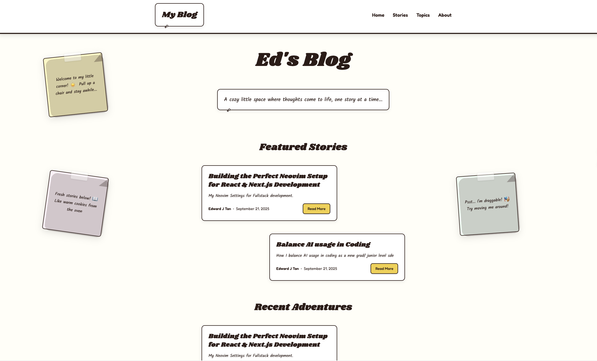
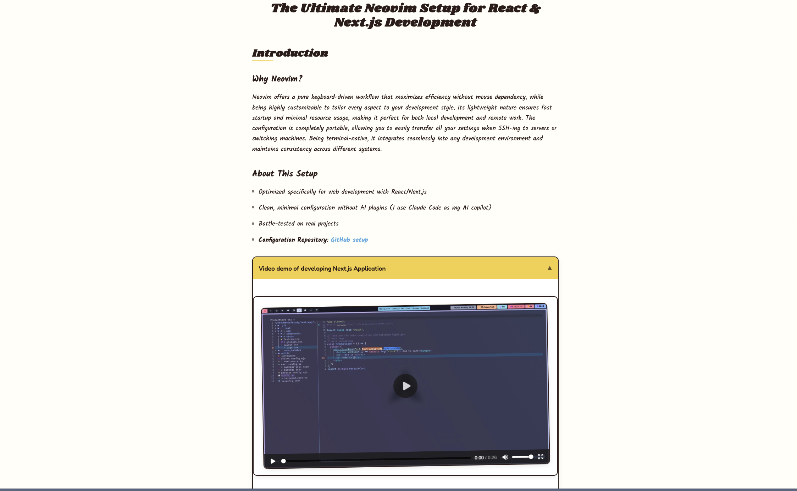
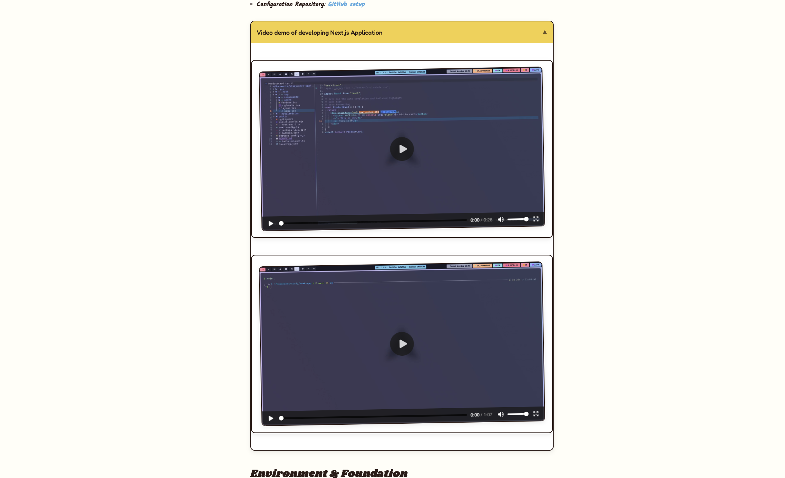

# Snoopy Blog

A whimsical blog platform inspired by Peanuts comic aesthetics, built with Next.js and PostgreSQL.

## Screenshots

### Homepage with Draggable Sticky Notes


### Blog Post with Comic Styling


### Notion-Style Toggle Lists


## Features

- **Comic-inspired Design**: Handwritten fonts, curved borders, and warm pastel colors
- **Draggable Sticky Notes**: Interactive homepage elements with smooth animations
- **Notion-Style Toggle Lists**: Collapsible content sections for better organization
- **Modern Tech Stack**: Next.js 14, TypeScript, Tailwind CSS, Drizzle ORM
- **PostgreSQL Database**: Robust data storage with migrations and seeding
- **Responsive Design**: Mobile-friendly with playful hover effects

## Design Philosophy

This blog embodies a minimalist Snoopy aesthetic emphasizing warmth and whimsy over corporate design. Features include:
- Kalam handwriting font for body text
- Shrikhand for headlines, Fredoka for UI elements
- Cream background (#fffef7) with warm brown text (#2d1b17)
- Curved borders, gentle animations, and organic shapes

## Quick Start

```bash
# Install dependencies
npm install

# Set up environment variables
cp .env.example .env.development.local

# Generate and run database migrations
npm run db:generate
npm run db:migrate

# Seed the database with sample posts
npm run db:seed

# Start development server
npm run dev
```

## Scripts

```bash
npm run dev          # Start development server with Turbopack
npm run build        # Build for production
npm run start        # Start production server
npm run lint         # Run ESLint

npm run db:generate  # Generate Drizzle migrations
npm run db:migrate   # Apply migrations to PostgreSQL
npm run db:studio    # Open Drizzle Studio (database GUI)
npm run db:seed      # Seed database with sample posts
```

## Tech Stack

- **Framework**: Next.js 14 with App Router
- **Language**: TypeScript
- **Styling**: Tailwind CSS with custom component layers
- **Database**: PostgreSQL with Drizzle ORM
- **Deployment**: Vercel-ready configuration

## Project Structure

```
src/
├── app/                    # Next.js App Router
│   ├── page.tsx           # Homepage with sticky notes
│   ├── layout.tsx         # Root layout
│   └── globals.css        # Snoopy design system
├── components/
│   ├── blog/              # Blog-specific components
│   ├── layout/            # Header, Footer
│   └── ui/                # Reusable UI components
└── lib/
    ├── db/                # Database schema and connection
    ├── seed.ts            # Database seeding
    └── utils.ts           # Utility functions
```

## Contributing

When adding features, maintain the whimsical Snoopy aesthetic that makes this blog feel like visiting a friend's cozy corner of the internet.

## License

MIT
